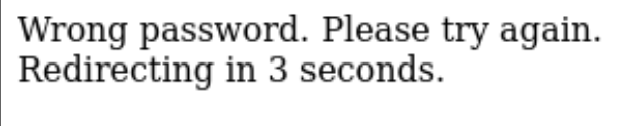

# Lookup

## Enumeration
Rustscan showed 2 ports open, port 80 and port 22 (ssh). Visiting the website, we are greeted with a login page.

When I entered the wrong credentials, it redirect us to screen saying wrong username and password. When I tried admin:admin,
I noticed that wrong username is not shown which means that if correct username was inputted but with wrong password, only wrong password will show up

Bruteforcing the admin password however did not yield any result so perhaps there may be another user that we can try.
I wrote a simple python script that send a request to enumeration through the username (since we can just check if "Username" does not appear in 
the response if so its a valid user) and found another user jose.

We then bruteforce the password of jose using hydra by running `hydra -l jose -P /usr/share/wordlists/rockyou.txt lookup.thm http-post-form "/login.php:username=^USER^&password=^PASS^:Wrong"`

## Login 
When we login, we are greeted by elfinder and there are some interesting files but unfortunately they are all just words that do not make sense.

I went to look for the elfinder version for potential cve and found that the version of elfinder is vulnerable to php injection
Running the exploit using metasploit gave me intial access but we are still unable to retrieve the user flag.

I ran linpeas on the system and linpeas flagged an unusual binary present called pwm. When I ran the binary, it execute id to get the user and then tries
to print the password file present in the user if it is found. What can be done now is to fake the 'id' by creating our own version of id by doing

`echo '#!/bin/bash' > /tmp/id` create file starting with #!/bin/bash
`echo 'echo "uid=33(think) gid=33(think) groups=(think)"' >> /tmp/id` append the format that id returns in the next line to spoof user
`chmod +x /tmp/id` set file as executable
`export PATH=/tmp:$PATH` export path to this current directory (I used tmp dir) so id will refer to the id we created
`/usr/sbin/pwm` execute the pwm binary

Now we got a list of password. We also know ssh is open so it's possible to ssh into it by using hydra and bruteforce the password

## Privilege escalation
Now inside user think, the user flag can be read. Running sudo -l we see that look can be run using sudo. I went to gtfobins and it shows that
look can be used to read file so what I did was `sudo look '' /root/root.txt` and the root flag is printed

